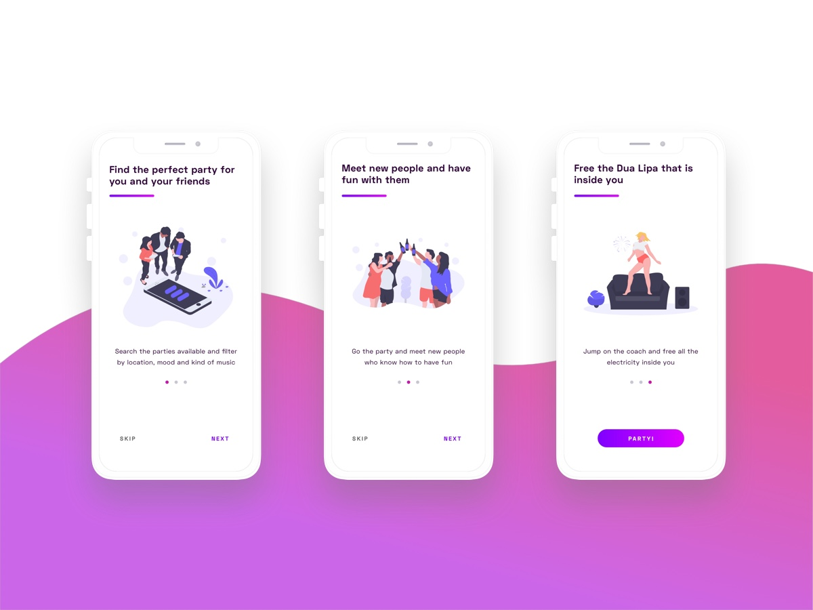
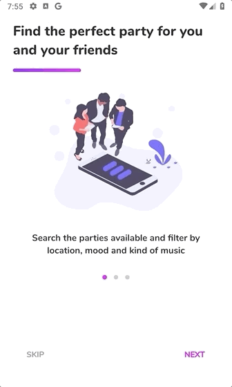

Este aplicativo faz parte de uma coleção de aplicativos que desenvolvi no Flutter com o objetivo de dominar as habilidades necessárias para implementar projetos personalizados de UI / UX no Android e iOS.

Você pode encontrar toda a coleção de aplicativos em [nesta postagem do blog] (https://dev.to/crivasgomez/flutter-uiux-design-implementations-518i) e todo o código-fonte [neste repositório do GitHub] (https: / /github.com/CRivasGomez/flutter-ui-ux-designs).

### [Original design](https://www.uplabs.com/posts/party-finding-concept) by [Lorenzo Restuccia](https://www.uplabs.com/lorenzo_restuccia_8):

### iOS demo:

### Android demo:

# onborading_flutter

